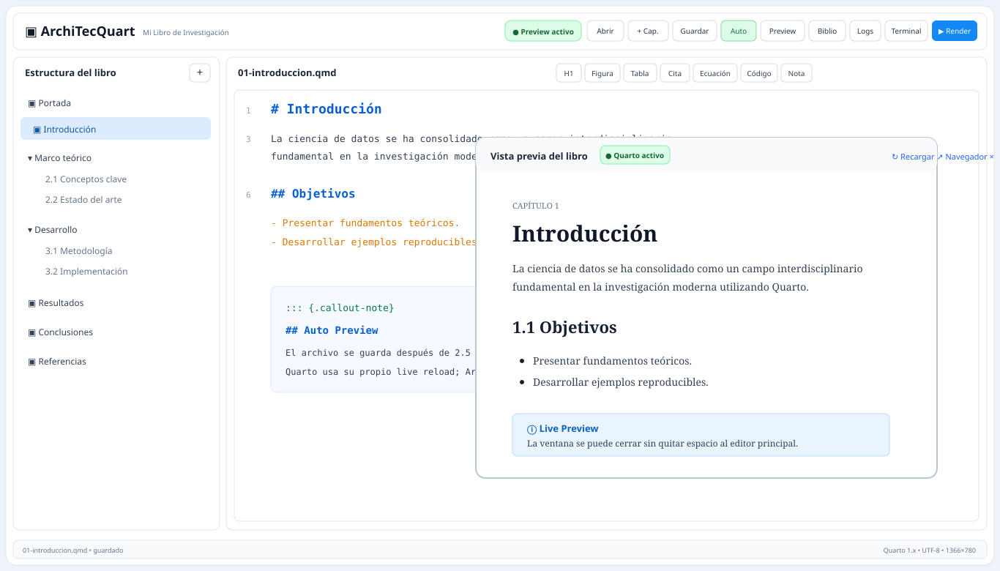

# ArchiTecQuart

### Quarto Book Studio para Arch Linux

Una aplicación de escritorio enfocada en escribir libros Quarto de forma visual, cómoda y rápida.

---

## ¿Qué es ArchiTecQuart?

ArchiTecQuart es una interfaz de escritorio construida alrededor del flujo real de Quarto.

No reemplaza Quarto, Pandoc ni tus archivos QMD. La idea es hacer más cómodo el trabajo de escribir un libro: estructura de capítulos a la izquierda, editor al centro, vista previa a la derecha y herramientas de bibliografía, logs y terminal en la parte inferior.

Tus proyectos siguen siendo proyectos Quarto normales y pueden abrirse también con VS Code, Positron, RStudio o Quarto CLI.

## Diseñado para 1366 × 780

La primera interfaz está ajustada especialmente para laptops con resolución aproximada de 1366 × 780:

- barra superior compacta;
- árbol del libro más ancho y fácil de leer;
- editor central usando casi todo el espacio disponible;
- sin preview lateral permanente;
- sin panel inferior ocupando altura;
- Preview, Bibliografía, Logs y Terminal como ventanas emergentes;
- botones y tipografías compactas.

En pantallas más grandes la distribución se expande automáticamente.

## Auto Preview sin estar ejecutando Render a cada rato

Este es uno de los objetivos principales del proyecto.

ArchiTecQuart NO lanza un render completo por cada tecla.

El flujo es:

~~~text
Escribes en el capítulo
        ↓
2.5 s sin cambios
        ↓
Auto-guardado del archivo QMD
        ↓
Quarto Preview ya sigue ejecutándose
        ↓
Quarto detecta el cambio
        ↓
Su live reload actualiza el Preview abierto
~~~

El proceso de Quarto Preview se inicia una sola vez y permanece activo mientras trabajas.

Esto evita la dinámica de:

~~~text
editar → ejecutar → esperar → revisar → volver a editar
~~~

El botón Auto Preview permite activar o pausar ese comportamiento.

## Funciones actuales

### Escritura

- Editor de archivos QMD.
- Números de línea.
- Resaltado básico de sintaxis Quarto/Markdown.
- Auto-guardado con debounce.
- Inserción rápida de:
  - títulos;
  - figuras;
  - tablas;
  - citas;
  - ecuaciones;
  - bloques de código;
  - callouts.

### Estructura del libro

ArchiTecQuart lee el archivo _quarto.yml y construye un árbol visual con:

- portada;
- capítulos;
- partes;
- subcapítulos;
- referencias.

El botón + Capítulo crea un nuevo archivo QMD y lo agrega automáticamente a la lista de capítulos del libro.

### Preview

La vista previa utiliza Quarto Preview real mediante un proceso persistente.

- no ocupa espacio permanentemente en la ventana principal;
- se abre en una ventana Qt WebEngine encima de ArchiTecQuart;
- se puede cerrar sin detener necesariamente tu aplicación;
- sigue el capítulo que estás editando;
- utiliza el live reload propio de Quarto;
- sólo se fuerza una recarga cuando tú pulsas Recargar;
- también puede abrirse en el navegador externo;
- un indicador verde/rojo muestra si Quarto Preview está ejecutándose.

### Render y exportación

Render ejecuta el proyecto según su configuración normal.

El menú Exportar incluye accesos directos para:

- HTML;
- PDF;
- EPUB.

PDF sigue dependiendo de que tu instalación de Quarto tenga las herramientas necesarias, como una distribución TeX cuando el proyecto la requiera.

### Bibliografía

El botón Biblio abre una ventana grande independiente. ArchiTecQuart detecta los archivos BibTeX configurados en _quarto.yml y muestra una tabla con:

- clave;
- autor;
- título;
- año;
- tipo.

### Logs

El botón Logs abre una ventana emergente con la salida en vivo de Quarto Preview y Quarto Render.

### Terminal

El botón Terminal abre una terminal Bash ligera en una ventana separada para comandos rápidos dentro del proyecto.

## Arquitectura

~~~text
┌────────────────────────────────────────────────────┐
│                 ArchiTecQuart                      │
│               PySide6 / Qt                        │
├──────────────────┬───────────────────────────────┤
│ Estructura        │ Editor QMD grande             │
│ del libro         │                               │
└──────────────────┴───────────────┬───────────────┘
                                   │
          ┌────────────────────────┼─────────────────────┐
          │                        │                     │
     Preview popup           Bibliografía/Logs     Terminal popup
                            │
                       Quarto CLI
                    ┌───────┴────────┐
                    │                │
             Quarto Preview     Quarto Render
              persistente       bajo demanda
~~~

## Requisitos

Necesitas Arch Linux o una distribución Linux compatible, Python y Quarto CLI.

Comprueba Quarto con:

~~~bash
quarto --version
~~~

## Instalación en Arch Linux

~~~bash
git clone https://github.com/alviomedina100041-prog/ARCHITECQUART.git
cd ARCHITECQUART
chmod +x scripts/install_arch.sh
./scripts/install_arch.sh
~~~

El instalador crea una instalación independiente en:

~~~text
~/.local/share/architecquart
~~~

También registra:

~~~text
~/.local/share/applications/architecquart.desktop
~/.local/bin/architecquart
~~~

Después puedes buscar ArchiTecQuart en el menú de aplicaciones.

El launcher usa Terminal=false, por lo que abre directamente como aplicación gráfica.

## Ejecutar desde el repositorio

~~~bash
python -m venv .venv
source .venv/bin/activate
pip install -r requirements.txt
chmod +x scripts/run_architecquart.sh
./scripts/run_architecquart.sh demo-book
~~~

## Libro de demostración

El repositorio incluye demo-book para probar la aplicación inmediatamente.

~~~bash
./scripts/run_architecquart.sh demo-book
~~~

Incluye portada, introducción, partes, capítulos, referencias y configuración HTML/EPUB.

## Trabajar con tu propio libro

Puedes iniciar directamente ArchiTecQuart indicando la carpeta:

~~~bash
architecquart ~/Documentos/MiLibro
~~~

O abrir la aplicación normalmente y pulsar Abrir.

La carpeta debe contener un proyecto Quarto Book con _quarto.yml.

## Actualizar

~~~bash
cd ~/ARCHITECQUART
git pull origin main
./scripts/install_arch.sh
~~~

## Desinstalar

~~~bash
~/.local/share/architecquart/scripts/uninstall_arch.sh
~~~

## Compatibilidad con Intel Haswell y equipos híbridos

El launcher incluye un perfil conservador para la laptop usada durante el desarrollo:

- LIBVA_DRIVER_NAME=i965;
- Vulkan deshabilitado dentro de Qt WebEngine;
- VA-API de Chromium deshabilitado;
- sin forzar un backend Qt inválido.

El objetivo es priorizar estabilidad del preview sobre aceleración gráfica.

## Estructura del repositorio

~~~text
ARCHITECQUART/
├── app/
│   ├── __init__.py
│   ├── main.py
│   ├── window.py
│   ├── editor.py
│   ├── book_model.py
│   ├── quarto_manager.py
│   ├── terminal.py
│   └── theme.py
│
├── assets/
│   ├── icon.svg
│   ├── icon.png
│   └── mockup.svg
│
├── demo-book/
│   ├── _quarto.yml
│   ├── index.qmd
│   ├── 01-introduccion.qmd
│   ├── 02-marco-teorico.qmd
│   ├── 03-metodologia.qmd
│   ├── 04-conclusiones.qmd
│   └── references.bib
│
├── scripts/
│   ├── architecquart.desktop
│   ├── install_arch.sh
│   ├── run_architecquart.sh
│   └── uninstall_arch.sh
│
├── .github/workflows/syntax.yml
├── requirements.txt
└── README.md
~~~

## Filosofía

ArchiTecQuart intenta seguir tres reglas:

1. Quarto sigue siendo el motor.
2. Tus archivos siguen siendo estándar.
3. La interfaz debe sentirse como un estudio para escribir libros y no como un editor genérico de código.

## Estado

Primera versión funcional.

Ya incluye la base necesaria para empezar a probar libros reales y seguir puliendo la experiencia directamente sobre Arch Linux.

---

**Quarto por dentro. Estudio de escritura por fuera.**

